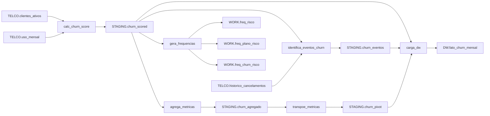

# job_complexo_analise_churn

## Objetivo

Este job realiza a análise mensal de propensão ao cancelamento (churn) de clientes da Telcostar S.A., calculando um score de risco individual com base em padrões de uso, histórico de contatos com suporte e características contratuais. Os resultados são consolidados em uma tabela de fatos no Data Warehouse, permitindo que as equipes de retenção priorizem ações sobre clientes com maior probabilidade de cancelamento no mês de referência.

---

## Diagrama de fluxo

---

## Datasets

| Dataset | Tipo | Descrição |
|---|---|---|
| `TELCO.clientes_ativos` | Input | Cadastro de clientes ativos com dados contratuais (plano, segmento, mensalidade, datas de ativação/cancelamento) |
| `TELCO.uso_mensal` | Input | Métricas de consumo mensal por cliente (minutos de voz, GB de dados, SMS, excedentes, contatos com suporte) |
| `TELCO.historico_cancelamentos` | Input | Registro histórico de cancelamentos com motivo, data e atendente responsável |
| `STAGING.churn_scored` | Output | Clientes ativos enriquecidos com score de churn, classificação de risco (ALTO/MEDIO/BAIXO) e variáveis derivadas |
| `STAGING.churn_eventos` | Output | Subconjunto de clientes com risco ≥ MEDIO cruzado com cancelamentos efetivos do período, com flag de churn realizado |
| `STAGING.churn_agregado` | Output | Métricas estatísticas (média, soma, desvio padrão, mín., máx.) agregadas por família de plano e nível de risco |
| `STAGING.churn_pivot` | Output | Tabela transposta com métricas médias dos clientes ALTO risco pivotadas por família de plano (uma coluna por plano) |
| `WORK.freq_risco` | Output | Distribuição de frequência de clientes por nível de risco (ALTO/MEDIO/BAIXO) |
| `WORK.freq_plano_risco` | Output | Tabela cruzada de frequência entre família de plano e nível de risco |
| `WORK.freq_churn_risco` | Output | Tabela cruzada entre churn realizado e nível de risco, com estatísticas de associação (qui-quadrado) |
| `DW.fato_churn_mensal` | Output | Tabela de fatos final no Data Warehouse, particionada por `ano_mes`, com score, flags de churn e metadados de carga |
| `WORK.PRE_PIVOT` | Output intermediário | Subconjunto temporário de métricas médias dos clientes ALTO risco, usado como entrada para o PROC TRANSPOSE |

---

## Transformações

1. **Definição de bibliotecas** — mapeia os caminhos físicos das bibliotecas `TELCO`, `STAGING` e `DW` via `LIBNAME`
2. **Join clientes × uso (`calc_churn_score` — Passo 1)** — une `clientes_ativos` e `uso_mensal` via `PROC SQL` para o período de referência (`ANO_MES_REF = 202501`), filtrando apenas clientes ativos ativados até 01/01/2025; calcula campos derivados como `meses_ativo`, `receita_acumulada` e `fl_sem_dados`; grava em `STAGING.churn_scored_raw`
3. **Cálculo do score de churn (`calc_churn_score` — Passo 2)** — aplica modelo de score ponderado (5 fatores: contatos com suporte 30%, ausência de uso de dados 25%, tempo de vida do cliente 20%, excedentes 15%, portabilidade 10%); classifica cada cliente em ALTO (≥ 0,70), MEDIO (≥ 0,40) ou BAIXO; usa `RETAIN` para calcular rank e receita acumulada por segmento; estima data de saída em 3 meses; grava em `STAGING.churn_scored`
4. **Identificação de eventos de churn (`identifica_eventos_churn`)** — filtra clientes com score ≥ 0,40 e cruza com `historico_cancelamentos` via `PROC SQL`; gera flag `fl_churnou` indicando se o cancelamento ocorreu dentro do período de referência; grava em `STAGING.churn_eventos`
5. **Agregação de métricas (`agrega_metricas`)** — calcula estatísticas descritivas (N, média, soma, desvio padrão, mín., máx.) de mensalidade, GB, voz, contatos com suporte e score, agrupadas por `familia_plano` × `cd_risco` via `PROC MEANS`; em seguida, `DATA STEP` adiciona participação percentual de receita e clientes e ticket médio por grupo
6. **Transposição de métricas (`transpoe_metricas`)** — filtra apenas clientes ALTO risco em `WORK.pre_pivot`; aplica `PROC TRANSPOSE` para pivotar métricas médias, gerando uma coluna por família de plano (`plano_<familia>`); grava em `STAGING.churn_pivot`
7. **Geração de frequências (`gera_frequencias`)** — executa `PROC FREQ` sobre `churn_scored` produzindo três tabelas: distribuição por risco (`WORK.freq_risco`), cruzamento plano × risco (`WORK.freq_plano_risco`) e cruzamento churn realizado × risco com teste qui-quadrado (`WORK.freq_churn_risco`); imprime no log a contagem de clientes ALTO risco
8. **Carga no Data Warehouse (`carga_dw`)** — consolida `churn_scored` com `churn_eventos` via `PROC SQL`, adicionando `ano_mes` e `dt_carga`; grava em `DW.fato_churn_mensal`; cria índice composto `(ano_mes, cd_risco)` via `PROC DATASETS` para otimizar consultas analíticas

---

## Dependências

- **Prerequisitos:** nenhum (job de carga primária)
- **Dependentes:** nenhum

---

## Construtos SAS detectados

| Construto | Tier | Confidence |
|---|---|---|
| `LIBNAME` | Rule | 100% |
| `MACRO_SIMPLE` (`calc_churn_score`) | LLM | 80% |
| `MACRO_SIMPLE` (`identifica_eventos_churn`) | LLM | 80% |
| `PROC_MEANS` | LLM | 80% |
| `DATA_STEP_SIMPLE` (score + RETAIN) | Rule | 100% |
| `PROC_TRANSPOSE` | LLM | 80% |
| `PROC_TRANSPOSE` (pre_pivot) | LLM | 80% |
| `PROC_FREQ` | LLM | 80% |
| `DATA_STEP_SIMPLE` (_NULL_ log) | Rule | 100% |
| `MACRO_SIMPLE` (`agrega_metricas`) | LLM | 80% |
| `MACRO_SIMPLE` (`transpoe_metricas`) | LLM | 80% |
| `MACRO_SIMPLE` (`gera_frequencias`) | LLM | 80% |
| `MACRO_SIMPLE` (`carga_dw`) | LLM | 80% |
| `MACRO_INVOCATION` (`%calc_churn_score`) | LLM | 80% |
| `MACRO_INVOCATION` (`%identifica_eventos_churn`) | LLM | 80% |
| `MACRO_INVOCATION` (`%agrega_metricas`) | LLM | 80% |
| `MACRO_INVOCATION` (`%transpoe_metricas`) | LLM | 80% |
| `MACRO_INVOCATION` (`%gera_frequencias`) | LLM | 80% |
| `MACRO_INVOCATION` (`%carga_dw`) | LLM | 80% |

---

## Riscos e observações

**1. Uso de `MONOTONIC()` em `PROC SQL` (não determinístico)**
`MONOTONIC()` não é uma função oficial do SAS SQL e seu comportamento depende da ordem física de leitura das linhas, podendo variar entre execuções. A coluna `row_num` gerada pode ser inconsistente.
→ **Ação:** Substituir por `ROW_NUMBER() OVER (ORDER BY ...)` no Databricks (PySpark/Spark SQL) ou remover a coluna se não for utilizada downstream.

**2. Data hardcoded no filtro de `identifica_eventos_churn`**
O filtro `h.dt_cancelamento BETWEEN '01JAN2025'd AND '31JAN2025'd` está fixo no código, ignorando o parâmetro `&ano_mes` para derivar o intervalo dinamicamente.
→ **Ação:** Parametrizar o intervalo usando `INTNX('MONTH', INPUT(...), 0, 'B')` e `'E'` a partir de `&ano_mes`, ou replicar a lógica equivalente em Spark com `date_trunc` e `last_day`. Confirmar com o time de negócio se o comportamento atual (sempre janeiro/2025) é intencional ou bug.

**3. Data hardcoded no filtro de `calc_churn_score`**
O filtro `c.dt_ativacao <= '01JAN2025'd` está fixo, tornando o job não reutilizável para outros períodos sem alteração manual do código.
→ **Ação:** Parametrizar usando `&ano_mes` para derivar a data de corte dinamicamente. Na migração, usar a variável de período como parâmetro de entrada do job Databricks.

**4. `COMPRESS(nm_cliente, ' ', 's')` com semântica ambígua**
O terceiro argumento `'s'` do `COMPRESS` instrui a remoção de espaços (modifier `s`), mas combinado com o segundo argumento `' '` o comportamento pode ser confuso e produzir nomes sem separação entre palavras.
→ **Ação:** Validar a saída de `nm_cliente_upper` em uma amostra antes de migrar. No Databricks, substituir por `regexp_replace(upper(nm_cliente), '\\s+', ' ')` para normalização segura.

**5. `pct_receita` e `pct_clientes` calculados com `SUM()` em DATA STEP (comportamento SAS específico)**
O uso de `SUM(sum_mensalidade)` dentro de um `DATA STEP` sem `BY` ou `RETAIN` explícito depende do comportamento de função de coluna do SAS, que percorre o dataset inteiro. Esse padrão não tem equivalente direto em Spark.
→ **Ação:** Reescrever como window function no Databricks: `SUM(sum_mensalidade) OVER ()` para total global, garantindo semântica equivalente.

**6. `PROC DATASETS` com criação de índice no DW**
A criação de índice via `PROC DATASETS` é um construto exclusivo de datasets SAS e não tem equivalente direto em Delta Lake/Databricks.
→ **Ação:** Avaliar substituição por particionamento da tabela Delta por `ano_mes` (`PARTITIONED BY (ano_mes)`) e Z-ORDER por `cd_risco`, que oferece otimização de leitura equivalente no Databricks.

**7. `CALCULATED` em `PROC SQL` para referenciar colunas derivadas**
O uso de `CALCULATED receita_acumulada` e `CALCULATED meses_ativo` é uma extensão SAS do SQL padrão, não suportada em Spark SQL.
→ **Ação:** Substituir por subconsultas ou CTEs no Databricks para referenciar colunas calculadas dentro da mesma query.

**8. Tabelas intermediárias gravadas em `STAGING` (persistência não controlada)**
Datasets como `STAGING.churn_scored_raw`, `STAGING.churn_scored` e `STAGING.churn_agregado` são gravados permanentemente na biblioteca STAGING sem limpeza explícita ao final do job, podendo causar acúmulo de dados entre execuções mensais.
→ **Ação:** Implementar lógica de `DROP TABLE IF EXISTS` antes de cada criação, ou adotar tabelas Delta com `OVERWRITE` particionado por `ano_mes` na migração para Databricks.
